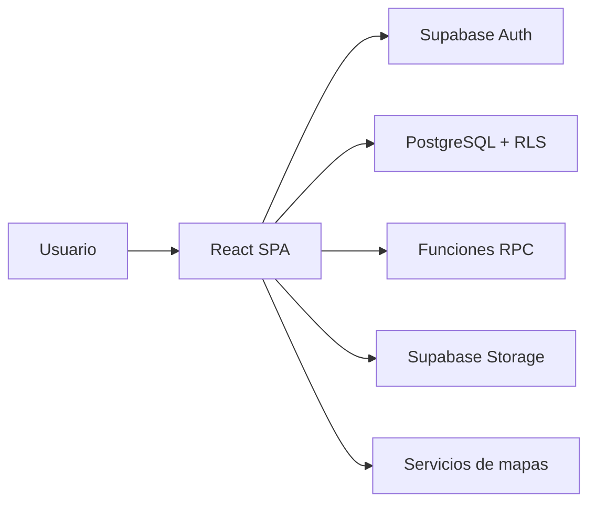

# Arquitectura general

**Estado:** En revisión · **Versión:** 0.1 · **Responsable:** Equipo MotoCare

MotoCare es una SPA con React 19, TypeScript y Vite. React Router controla navegación y rutas protegidas. Tailwind CSS y componentes locales basados en Radix UI forman la interfaz.

El cliente usa Supabase para Auth, PostgreSQL, RPC y Storage. El esquema aplica RLS. No se encontró un backend independiente.

`src/pages` contiene pantallas; `src/components`, `src/layouts` y `src/contexts`, UI y sesión; `src/lib`, integraciones; `supabase`, datos; `tests`, Playwright.
